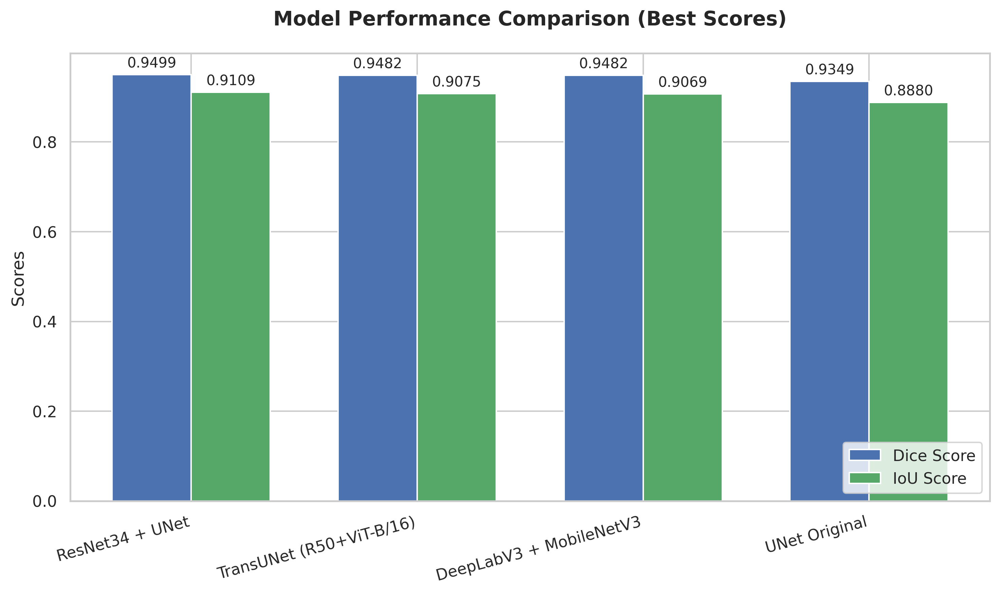
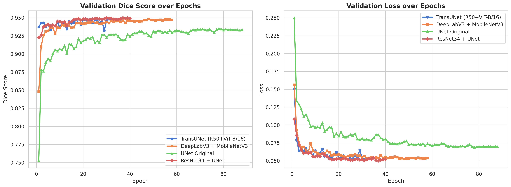

# Skin Lesion Segmentation (ISIC 2018 - Task 1)

[](https://www.python.org/)
[](https://pytorch.org/)
[](https://albumentations.ai/)
[](https://dagshub.com/)
[](https://mlflow.org/)

Dự án nghiên cứu và phát triển hệ thống AI **Phân đoạn vùng tổn thương da** (Skin Lesion Segmentation) trên ảnh nội soi dermoscopy, sử dụng bộ dữ liệu chuẩn quốc tế **ISIC 2018 Challenge (Task 1)**. 

Mã nguồn được thiết kế theo chuẩn hướng đối tượng (OOP) và dạng mô-đun hóa cao (highly modularized), đảm bảo tính tái tạo kết quả thử nghiệm (reproducibility) và tối ưu hóa hiệu năng huấn luyện trên môi trường phân tán đa GPU. Dự án tích hợp các kiến trúc phân đoạn tiên tiến, quy trình MLOps hiện đại, cơ chế huấn luyện song song phân tán (DDP), độ chính xác hỗn hợp (AMP), và tăng cường dữ liệu khi kiểm thử (Test-Time Augmentation - TTA).

---

## Các tính năng nổi bật

### 1. Kiến trúc mô hình đa dạng (Model Factory)
Dự án hỗ trợ chuyển đổi linh hoạt giữa nhiều kiến trúc mô hình phân đoạn khác nhau thông qua file cấu hình YAML:
*   **U-Net (ResNet Backbones):** Sử dụng bộ mã hóa tiền huấn luyện mạnh mẽ (ResNet34, ResNet50) kết hợp cơ chế chú ý không gian-kênh **scSE (Spatial-Channel Squeeze-and-Excitation)** ở khối giải mã giúp tập trung vào các vùng tổn thương quan trọng.
*   **UNet Original:** Kiến trúc U-Net truyền thống xây dựng hoàn toàn từ đầu (scratch) để làm baseline đối chứng.
*   **DeepLabV3 & DeepLabV3+:** Sử dụng mạng xương sống MobileNetV3-Large (gọn nhẹ cho thiết bị di động/nhúng) hoặc ResNet50, tích hợp khối **ASPP (Atrous Spatial Pyramid Pooling)** để nắm bắt đặc trưng đa tỷ lệ.
*   **TransUNet (Hybrid ViT-CNN):** Sự kết hợp tiên tiến giữa **Vision Transformer (ViT-B/16)** để khai thác mối quan hệ ngữ cảnh toàn cục và các lớp CNN để duy trì độ phân giải chi tiết không gian cục bộ.

### 2. Quy trình MLOps tích hợp (DagsHub & MLflow)
*   **Experiment Tracking:** Tự động đồng bộ hóa các siêu tham số cấu hình, chỉ số chất lượng từng epoch (Dice, Loss, Learning Rate) lên đám mây **DagsHub MLflow** theo thời gian thực.
*   **Automated Selective Upload (Tải lên mô hình chọn lọc):** Trong quá trình huấn luyện, hệ thống chỉ đẩy các chỉ số và đồ thị nhẹ (vài KB) để theo dõi. Sau khi tất cả mô hình hoàn tất, cell so sánh cuối cùng sẽ **tự động xác định mô hình tốt nhất (Top 1)** và tải tệp trọng số nặng `.pth` của mô hình đó lên DagsHub Artifacts phục vụ cho việc phát triển Web/API sau này.

### 3. Tối ưu hóa hiệu năng & Kỹ thuật huấn luyện nâng cao
*   **Huấn luyện song song phân tán (DDP):** Hỗ trợ đầy đủ huấn luyện phân tán đa GPU thông qua cơ chế `DistributedDataParallel` của PyTorch và công cụ khởi chạy `torchrun` (tối ưu hóa cho môi trường Kaggle 2x T4 GPU).
*   **Độ chính xác hỗn hợp tự động (Automatic Mixed Precision - AMP):** Sử dụng `torch.cuda.amp` (FP16) giúp tăng tốc độ tính toán lên **1.5x - 2x** và tiết kiệm đến **50%** bộ nhớ GPU.
*   **Tăng cường dữ liệu khi kiểm thử (Test-Time Augmentation - TTA):** Áp dụng kỹ thuật TTA trên 5 góc nhìn hình học khác nhau (ảnh gốc, lật ngang, lật dọc, xoay 90 độ, xoay 270 độ) giúp tăng cường độ chính xác và làm mịn các biên phân đoạn.
*   **Tối ưu hóa học tập:** Sử dụng tỷ lệ học phân biệt (**Differential Learning Rates** - cho phép backbone học chậm hơn decoder), cơ chế dừng sớm (**Early Stopping**) và tự động giảm tỷ lệ học (**ReduceLROnPlateau**).

---

## 📁 Cấu trúc thư mục dự án

```text
Skin_Lesion_Segmentation/
├── configs/                  # Các file cấu hình hệ thống và thử nghiệm
│   ├── base.yaml             # Cấu hình mặc định cho dự án
│   └── experiments/          # Cấu hình ghi đè cho từng mô hình thử nghiệm cụ thể
├── scripts/                  # Các kịch bản chạy chính của hệ thống
│   ├── prepare_data.py       # Tiền xử lý và chia tách tập dữ liệu (Train/Val/Test)
│   ├── train.py              # Kịch bản huấn luyện mô hình (GPU đơn lẻ hoặc DDP)
│   ├── evaluate.py           # Đánh giá mô hình trên tập kiểm thử (kết hợp TTA)
│   ├── predict.py            # Chạy suy luận và trực quan hóa kết quả phân đoạn
│   └── benchmark_fps.py      # Tiện ích đo đạc độ trễ và tốc độ xử lý FPS của mô hình
├── src/                      # Thư mục mã nguồn lõi (Core Modules)
│   ├── data/                 # Lớp nạp dữ liệu và kịch bản tăng cường ảnh (Albumentations)
│   ├── models/               # Bộ xây dựng mô hình và các kiến trúc mạng tùy chỉnh
│   ├── losses/               # Định nghĩa các hàm mất mát (Focal Loss, Dice Loss)
│   ├── metrics/              # Chỉ số đánh giá hiệu năng (Dice Coefficient, IoU)
│   ├── inference/            # Tiện ích dự đoán kết hợp TTA
│   ├── training/             # Lớp Trainer điều phối huấn luyện và các Callbacks
│   └── utils/                # Đọc cấu hình, checkpoint, ghi nhận nhật ký hệ thống
├── outputs/                  # Thư mục lưu trữ biểu đồ và chỉ số so sánh (được đẩy lên GitHub)
├── requirements.txt          # Các thư viện tối thiểu cần cài đặt (phù hợp với Kaggle)
├── environment.yml           # File thiết lập môi trường ảo Conda cho máy cục bộ
└── pyproject.toml            # File định nghĩa thông tin đóng gói dự án Python
```

---

## 📊 Kết quả thực tế & So sánh hiệu năng

Các thử nghiệm được thực hiện trên tập dữ liệu **ISIC 2018 Task 1** (với tỷ lệ chia Train/Val/Test lần lượt là 80%/10%/10%). 

### 1. Bảng so sánh hiệu năng các mô hình (Sắp xếp theo Dice Score)

Dưới đây là kết quả thống kê các chỉ số tối ưu nhất đạt được trên tập Kiểm định (Validation Set):

| Xếp hạng | Kiến trúc Mô hình (Model) | Epoch tốt nhất | Dice Score (Validation) | IoU Score (Validation) | Loss nhỏ nhất (Min Val Loss) | Trọng số (.pth) trên DagsHub |
| :---: | :--- | :---: | :---: | :---: | :---: | :---: |
| **1** | **ResNet34 + UNet** | 37 | **0.9499** (94.99%) | **0.9109** (91.09%) | **0.0502** | **Đã Upload** (Tốt nhất) |
| **2** | **TransUNet (R50+ViT-B/16)** | 23 | 0.9482 (94.82%) | 0.9075 (90.75%) | 0.0522 | **Đã Upload** (Mô hình Lai) |
| **3** | **DeepLabV3 + MobileNetV3** | 48 | 0.9482 (94.82%) | 0.9069 (90.69%) | 0.0527 | Bỏ qua (Tiết kiệm bộ nhớ) |
| 4 | **UNet Original** (Scratch) | 78 | 0.9349 (93.49%) | 0.8880 (88.80%) | 0.0689 | Bỏ qua (Tiết kiệm bộ nhớ) |

### 2. Trực quan hóa kết quả so sánh

#### Biểu đồ so sánh Dice & IoU tốt nhất (Model Performance Comparison)


#### Đường cong huấn luyện trên tập Validation qua các Epoch (Learning Curves)


*Nhận xét:*
*   Mô hình **ResNet34 + UNet** đạt hiệu suất cao nhất với độ chính xác Dice vượt trội là **94.99%** và IoU là **91.09%**.
*   **TransUNet** hội tụ rất nhanh (chỉ cần 23 epoch) đạt Dice **94.82%**, chứng tỏ sức mạnh của cơ chế Self-Attention trong việc thu nhận thông tin ngữ cảnh lớn toàn cục.
*   **DeepLabV3 + MobileNetV3** cho kết quả vô cùng ấn tượng (Dice **94.82%**) mặc dù có lượng tham số cực kỳ nhỏ gọn, thích hợp cho việc triển khai trên các thiết bị cấu hình yếu.

---

## Hướng dẫn cài đặt và sử dụng

### 1. Thiết lập môi trường

#### **Trên máy cá nhân (Local)**
```bash
# Tải mã nguồn dự án
git clone https://github.com/NgThanhQuyen/Skin_Lesion_Segmentation.git
cd Skin_Lesion_Segmentation

# Khởi tạo môi trường ảo Conda
conda env create -f environment.yml
conda activate CV

# Cài đặt thư mục mã nguồn ở chế độ chỉnh sửa (editable mode)
pip install -e .
```

#### **Trên môi trường Kaggle Notebook**
Thực thi dòng lệnh sau tại cell cài đặt thư viện:
```bash
!pip install -r requirements.txt -q
```

---

### 2. Cấu hình xác thực DagsHub (Bảo mật)
Để sử dụng tính năng Experiment Tracking và tự động upload mô hình lên DagsHub một cách an toàn mà không lộ token trên notebook công khai:

1.  Lấy Access Token từ DagsHub tại: [DagsHub Settings Tokens](https://dagshub.com/settings/tokens).
2.  Trong giao diện Kaggle Notebook, chọn **Add-ons** -> **Secrets**, thêm một Secret mới có nhãn (Key) là `DAGSHUB_TOKEN` và dán Token của bạn vào.
3.  Chạy cell đăng nhập trong file notebook:
    ```python
    import os
    import getpass
    import dagshub

    token = None
    try:
        from kaggle_secrets import UserSecretsClient
        user_secrets = UserSecretsClient()
        token = user_secrets.get_secret("DAGSHUB_TOKEN")
        print("Đã đăng nhập DagsHub thông qua Kaggle Secrets!")
    except Exception:
        token = os.environ.get("DAGSHUB_TOKEN") or getpass.getpass("Nhập Access Token: ")

    if token:
        dagshub.auth.add_app_token(token)
    ```

---

### 3. Tiền xử lý dữ liệu
1.  Tải bộ dữ liệu ISIC 2018 Task 1, giải nén và cấu trúc như sau:
    ```text
    data/data-HA10000-remove-hair/
    ├── remove-hair/images/     # Ảnh nội soi dermoscopy (ISIC_*.jpg)
    └── masks/                  # Ảnh mặt nạ phân đoạn thực tế (ISIC_*.png)
    ```
2.  Chạy kịch bản phân chia tập dữ liệu thành các tập Train (80%), Val (10%), Test (10%):
    ```bash
    python scripts/prepare_data.py
    ```

---

### 4. Huấn luyện mô hình

#### **Chạy trên thiết bị đơn lẻ (Local)**
```bash
python scripts/train.py --config configs/experiments/resnet34_unet_v1.yaml
```

#### **Huấn luyện song song phân tán (Kaggle 2x T4 GPU - Chế độ DDP)**
```bash
!torchrun --standalone --nnodes=1 --nproc_per_node=2 scripts/train.py \
  --device-mode ddp \
  --config configs/experiments/resnet34_unet_kaggle_t4.yaml \
  data.root=/kaggle/input/datasets/quynnguynthanh/isic-2018-task1/ISIC_2018_TASK1 \
  output.dir=/kaggle/working \
  logging.use_wandb=false \
  logging.use_dagshub=true \
  logging.dagshub_username=nguyenthanhquyen145 \
  logging.dagshub_repo=Skin_Lesion_Segmentation
```

---

### 5. Kiểm thử và Suy luận dự đoán (Inference)

#### **Chạy đánh giá trên tập kiểm thử kèm kỹ thuật TTA**
Đánh giá chất lượng mô hình trên tập kiểm thử (Test Set) và tự động tính toán ngưỡng tối ưu hóa nhị phân:
```bash
python scripts/evaluate.py \
  --config configs/experiments/resnet34_unet_v1.yaml \
  --checkpoint outputs/resnet34_unet_v1/best_model.pth \
  --split test \
  --tta
```

#### **Chạy suy luận dự đoán và xuất ảnh overlay phân đoạn**
```bash
python scripts/predict.py \
  --config configs/experiments/resnet34_unet_v1.yaml \
  --checkpoint outputs/resnet34_unet_v1/best_model.pth \
  --input data/processed/test/images \
  --output outputs/predictions \
  --tta \
  --overlay
```
