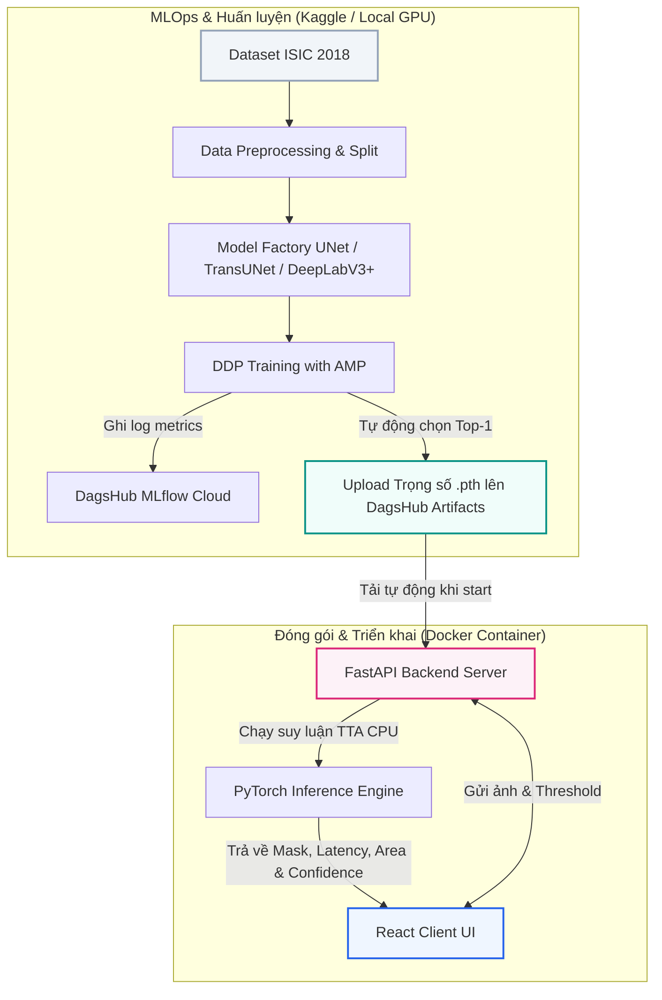
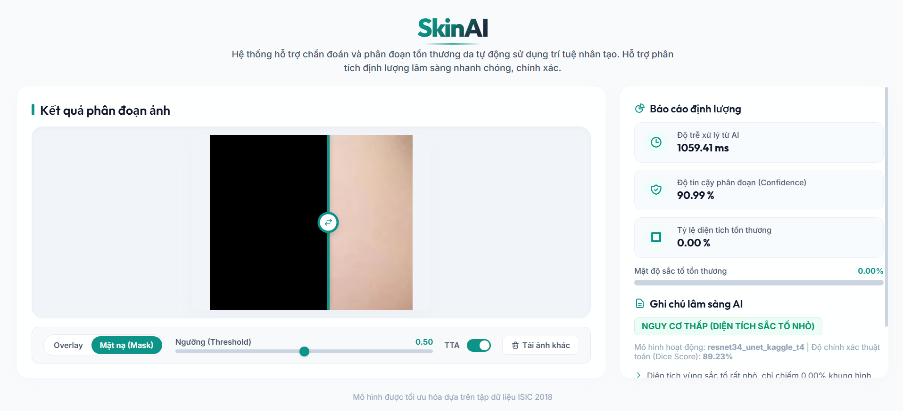
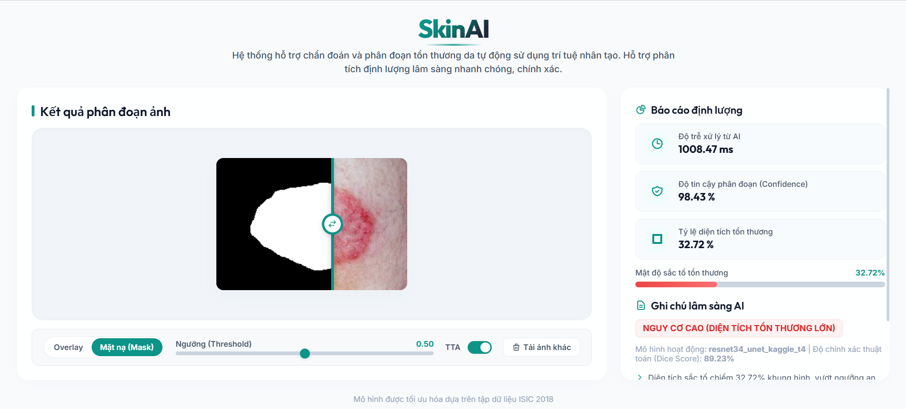

# Skin Lesion Segmentation (ISIC 2018 - Task 1)

[](https://www.python.org/)
[](https://pytorch.org/)
[](https://fastapi.tiangolo.com/)
[](https://react.dev/)
[](https://www.docker.com/)
[](https://mlflow.org/)
[](https://dagshub.com/)

Hệ thống nghiên cứu, huấn luyện học sâu và chẩn đoán lâm sàng tự động **Phân đoạn vùng tổn thương da (Skin Lesion Segmentation)** trên ảnh nội soi Dermoscopy, sử dụng bộ dữ liệu chuẩn quốc tế **ISIC 2018 Challenge (Task 1)**.

Mã nguồn được thiết kế theo chuẩn hướng đối tượng (OOP), cấu trúc mô-đun hóa cao, đáp ứng các tiêu chuẩn kỹ thuật nghiêm ngặt trong sản xuất (Production-Ready). Hệ thống kết hợp quy trình MLOps tiên tiến (DagsHub/MLflow), huấn luyện song song phân tán (DDP), tối ưu hóa hiệu năng (AMP, TTA) và giao diện web hỗ trợ bác sĩ chẩn đoán định lượng thời gian thực.

---

## Kiến trúc Hệ thống (System Architecture)

Sơ đồ dưới đây trực quan hóa luồng dữ liệu từ quá trình Huấn luyện/MLOps trên Kaggle đến giai đoạn Triển khai Production & Chẩn đoán lâm sàng thông qua Docker:



---

## Các tính năng nổi bật

### 1. Kiến trúc mô hình đa dạng (Model Factory)
Chuyển đổi linh hoạt giữa nhiều kiến trúc mô hình phân đoạn tiên tiến thông qua cấu hình YAML:
*   **U-Net (ResNet Backbones):** Tích hợp encoder tiền huấn luyện mạnh mẽ (ResNet34, ResNet50) cùng cơ chế chú ý **scSE (Spatial-Channel Squeeze-and-Excitation)** ở khối giải mã decoder giúp mô hình tập trung vào ranh giới tổn thương bất quy tắc.
*   **TransUNet (Hybrid ViT-CNN):** Mạng lai kết hợp **Vision Transformer (ViT-B/16)** để khai thác mối quan hệ ngữ cảnh toàn cục (Global Context) và các lớp CNN để duy trì chi tiết không gian cục bộ chất lượng cao.
*   **DeepLabV3+:** Sử dụng backbone MobileNetV3-Large gọn nhẹ tích hợp khối **ASPP (Atrous Spatial Pyramid Pooling)** để xử lý đặc trưng đa tỷ lệ, tối ưu hóa khi chạy trên CPU của container Docker.

### 2. Quy trình MLOps tự động hóa (DagsHub & MLflow)
*   **Experiment Tracking:** Tự động đồng bộ hóa các siêu tham số, chỉ số chất lượng từng epoch (Dice Coefficient, IoU, Learning Rate) lên **DagsHub MLflow** theo thời gian thực.
*   **Automated Selective Upload:** Quá trình huấn luyện chỉ đẩy biểu đồ và metrics nhẹ. Khi kết thúc, hệ thống so sánh tự động tìm ra mô hình tốt nhất (Top 1) và chỉ upload tệp trọng số nặng `.pth` của mô hình đó lên DagsHub Artifacts để tối ưu tài nguyên đám mây.

### 3. Tối ưu hóa hiệu năng & Huấn luyện nâng cao
*   **Huấn luyện song song phân tán (DDP):** Hỗ trợ đầy đủ huấn luyện phân tán đa GPU qua `DistributedDataParallel` và công cụ khởi chạy `torchrun` (tối ưu hóa hoàn toàn cho môi trường Kaggle 2x T4 GPU).
*   **Độ chính xác hỗn hợp tự động (AMP):** Sử dụng `torch.cuda.amp` (FP16) giúp tăng tốc độ huấn luyện **1.5x - 2x** và tiết kiệm đến **50%** bộ nhớ VRAM của GPU.
*   **Tăng cường dữ liệu khi kiểm thử (Test-Time Augmentation - TTA):** Áp dụng TTA trên 5 góc nhìn hình học khác nhau giúp tăng cường độ mịn của biên phân đoạn và cải thiện độ chính xác tổng thể.

### 4. Ứng dụng Web Chẩn Đoán Lâm Sàng (FastAPI + React)
*   **Bố cục gọn gàng (Viewport-height layout):** Giao diện thiết kế theo phong cách Glassmorphism y tế cao cấp, hiển thị khít trong một màn hình làm việc mà không cần cuộn dọc.
*   **Thanh trượt so sánh Before-After:** Giúp các bác sĩ dễ dàng rê chuột/vuốt màn hình để kiểm tra trực quan ranh giới khoanh vùng tổn thương so với ảnh da ban đầu.
*   **Độ tin cậy phân đoạn (Confidence - Động):** Tính toán độ tin cậy thực tế (từ 0% - 100%) của mô hình trên từng pixel của ảnh đầu vào, cho thấy thuật toán chắc chắn bao nhiêu phần trăm về vùng phân đoạn.
*   **Ghi chú lâm sàng AI động:** Tự động đưa ra các khuyến nghị y khoa và mức độ nguy cơ (Thấp / Trung bình / Cao) tùy biến theo đúng tỷ lệ phần trăm diện tích tổn thương thực tế.
*   **Debounced Request:** Chỉ gửi yêu cầu tính toán lại đến API backend khi người dùng **buông chuột/buông tay** khỏi thanh kéo ngưỡng (Threshold) để tránh làm nghẽn CPU/GPU.

#### Trực quan hóa Giao diện Chẩn đoán Lâm sàng
Để minh họa các kịch bản hoạt động của ứng dụng, dưới đây là giao diện chẩn đoán tương ứng với hai trường hợp lâm sàng:

| Trường hợp: Da bình thường (Không phát hiện tổn thương sắc tố) | Trường hợp: Da bị tổn thương (Phân đoạn và khoanh vùng bệnh) |
| :---: | :---: |
|  |  |

---

## Cấu trúc thư mục dự án

```text
Skin_Lesion_Segmentation/
├── configs/                  # Các file cấu hình hệ thống và thử nghiệm
│   ├── base.yaml             # Cấu hình mặc định cho toàn bộ dự án
│   └── experiments/          # Cấu hình ghi đè cho từng mô hình thử nghiệm cụ thể
├── scripts/                  # Các kịch bản chạy chính của hệ thống
│   ├── prepare_data.py       # Tiền xử lý và chia tách tập dữ liệu (Train/Val/Test)
│   ├── train.py              # Kịch bản huấn luyện mô hình (GPU đơn lẻ hoặc DDP)
│   ├── evaluate.py           # Đánh giá mô hình trên tập kiểm thử (kết hợp TTA)
│   ├── predict.py            # Chạy suy luận offline và trực quan hóa kết quả
│   └── benchmark_fps.py      # Tiện ích đo đạc tốc độ xử lý FPS và độ trễ mô hình
├── src/                      # Thư mục mã nguồn lõi (Core Modules)
│   ├── data/                 # Lớp nạp dữ liệu và kịch bản tăng cường ảnh (Albumentations)
│   ├── models/               # Bộ xây dựng mô hình và các kiến trúc mạng tùy chỉnh
│   ├── losses/               # Định nghĩa các hàm mất mát (Focal Loss, Dice Loss)
│   ├── metrics/              # Chỉ số đánh giá hiệu năng (Dice Coefficient, IoU)
│   ├── inference/            # Tiện ích dự đoán kết hợp TTA
│   ├── training/             # Lớp Trainer điều phối huấn luyện và các Callbacks
│   └── utils/                # Đọc cấu hình, checkpoint, ghi nhận nhật ký hệ thống
├── web_app/                  # Ứng dụng Web chẩn đoán lâm sàng
│   ├── app.py                # Máy chủ FastAPI Backend API & Static Router
│   ├── dagshub_sync.py       # Tiện ích tự động đồng bộ mô hình tốt nhất từ DagsHub
│   ├── requirements.txt      # Dependencies Python phục vụ cho Web App
│   ├── checkpoints/          # Thư mục cache lưu trữ trọng số mô hình tốt nhất cục bộ
│   └── frontend/             # Dự án React Frontend (Vite + TypeScript)
│       ├── src/              # Logic giao diện React và CSS Premium Theme
│       ├── index.html        # File HTML chính
│       └── package.json      # Định nghĩa các package Javascript
├── outputs/                  # Thư mục lưu trữ biểu đồ và chỉ số so sánh hiệu năng
├── Dockerfile                # File cấu hình đóng gói Docker toàn bộ ứng dụng
├── docker-compose.yml        # File khởi chạy nhanh Docker Compose
├── .dockerignore             # Danh sách loại trừ khi build Docker image
├── .gitignore                # Danh sách loại trừ khi push git
├── requirements.txt          # Các thư viện Python phục vụ huấn luyện (phù hợp với Kaggle)
└── pyproject.toml            # File định nghĩa thông tin đóng gói dự án Python
```

---

## Kết quả thực tế & So sánh hiệu năng

Thống kê hiệu năng mô hình trên tập dữ liệu **ISIC 2018 Task 1** (với tỷ lệ chia Train/Val/Test lần lượt là 80%/10%/10%):

| Xếp hạng | Kiến trúc Mô hình (Model) | Epoch tốt nhất | Dice Score (Validation) | IoU Score (Validation) | Loss nhỏ nhất (Min Val Loss) | Trọng số (.pth) trên DagsHub |
| :---: | :--- | :---: | :---: | :---: | :---: | :---: |
| **1** | **ResNet34 + UNet** | 37 | **0.9499** (94.99%) | **0.9109** (91.09%) | **0.0502** | **Đã Upload** (Tốt nhất) |
| **2** | **TransUNet (R50+ViT-B/16)** | 23 | 0.9482 (94.82%) | 0.9075 (90.75%) | 0.0522 | **Đã Upload** (Mô hình Lai) |
| **3** | **DeepLabV3 + MobileNetV3** | 48 | 0.9482 (94.82%) | 0.9069 (90.69%) | 0.0527 | Bỏ qua (Tiết kiệm bộ nhớ) |
| 4 | **UNet Original** (Scratch) | 78 | 0.9349 (93.49%) | 0.8880 (88.80%) | 0.0689 | Bỏ qua (Tiết kiệm bộ nhớ) |

#### Biểu đồ đánh giá huấn luyện và so sánh mô hình
Dưới đây là các đồ thị biểu diễn kết quả huấn luyện mô hình và so sánh trực quan hiệu năng giữa các kiến trúc:

| Đồ thị đường cong huấn luyện (Learning Curves) | Biểu đồ so sánh hiệu năng các mô hình (Model Comparison) |
| :---: | :---: |
|  |  |

---

## Hướng dẫn cài đặt và sử dụng

### 1. Thiết lập môi trường cục bộ (Local Setup)
Yêu cầu hệ điều hành Linux hoặc Windows, có cài đặt Conda (Miniconda / Anaconda).

```bash
# Tải mã nguồn dự án
git clone https://github.com/NgThanhQuyen/Skin_Lesion_Segmentation.git
cd Skin_Lesion_Segmentation

# Khởi tạo môi trường ảo Conda
conda env create -f environment.yml
conda activate CV

# Cài đặt thư mục mã nguồn ở chế độ chỉnh sửa (editable mode)
pip install -e .
```

### 2. Cấu hình xác thực DagsHub (Bảo mật)
Để hệ thống tự động đồng bộ mô hình và theo dõi log mà không lộ thông tin xác thực trên các nền tảng công khai:
1.  Lấy Access Token cá nhân từ DagsHub tại: [DagsHub Settings Tokens](https://dagshub.com/settings/tokens).
2.  Tạo tệp tin [web_app/.env](file:///f:/5/2/Thi_giac_may_tinh/Nhom24-GK-ComputerVision/Skin_Lesion_Segmentation/web_app/.env) từ file template mẫu:
    ```bash
    cp web_app/.env.example web_app/.env
    ```
3.  Mở file `.env` và điền token của bạn:
    ```env
    DAGSHUB_USERNAME=nguyenthanhquyen145
    DAGSHUB_REPO=Skin_Lesion_Segmentation
    DAGSHUB_TOKEN=your_dagshub_access_token_here
    ```

### 3. Tiền xử lý dữ liệu & Huấn luyện
1.  Tải bộ dữ liệu **ISIC 2018 Task 1**, giải nén và cấu trúc như sau:
    ```text
    data/data-HA10000-remove-hair/
    ├── remove-hair/images/     # Ảnh nội soi gốc (ISIC_*.jpg)
    └── masks/                  # Ảnh mặt nạ phân đoạn thực tế (ISIC_*.png)
    ```
2.  Chạy phân chia tập dữ liệu thành các tập Train (80%), Val (10%), Test (10%):
    ```bash
    python scripts/prepare_data.py
    ```
3.  Huấn luyện mô hình trên thiết bị cục bộ:
    ```bash
    python scripts/train.py --config configs/experiments/resnet34_unet_v1.yaml
    ```

---

## Khởi chạy Web Application chẩn đoán

### Cách 1: Khởi chạy cục bộ (Dành cho nhà phát triển)
1.  **Biên dịch Frontend (React):**
    ```bash
    cd web_app/frontend
    npm install
    npm run build
    cd ../..
    ```
2.  **Chạy server FastAPI:**
    ```bash
    python -m uvicorn web_app.app:app --reload
    ```
3.  Truy cập vào ứng dụng tại trình duyệt: `http://localhost:8000`.

---

## Cách 2: Triển khai nhanh bằng Docker Compose (Khuyên dùng)
Ứng dụng đã được cấu hình trọn gói bằng Docker Compose, tự động xử lý toàn bộ các công đoạn cài đặt Node.js biên dịch frontend và thiết lập máy chủ Python.

1.  **Thiết lập môi trường:** Đảm bảo bạn đã điền chính xác Token DagsHub vào file [web_app/.env](file:///f:/5/2/Thi_giac_may_tinh/Nhom24-GK-ComputerVision/Skin_Lesion_Segmentation/web_app/.env).
2.  **Mở Docker Desktop** trên máy tính của bạn và đợi trạng thái hoạt động sẵn sàng.
3.  **Chạy lệnh khởi chạy duy nhất:**
    ```bash
    docker compose up --build
    ```
    *Lưu ý: Lệnh này sẽ chạy trực tiếp trên màn hình terminal để bạn theo dõi log. Bạn có thể nhấn tổ hợp phím **`Ctrl + C`** bất kỳ lúc nào để dừng và tắt container một cách an toàn.*
4.  Mở trình duyệt và truy cập vào ứng dụng tại: `http://localhost:8888`.
    *Hệ thống sẽ tự động đồng bộ mô hình tốt nhất từ DagsHub của bạn về thư mục cache cục bộ khi chạy lần đầu tiên.*
